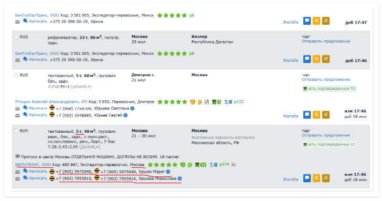
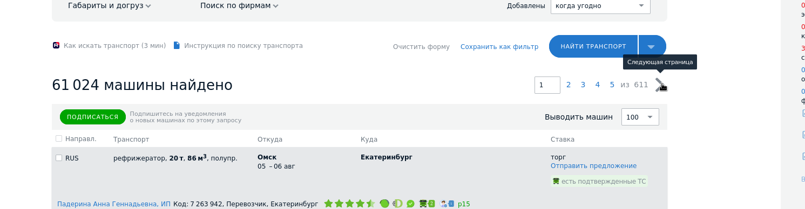

# Парсинг сайта trucks.ati

## Входные аргументы
Список аргументов:
- Минимальная грузоподъёмность (в тоннах). Дефолтное значение = 5
- Количество записей в одной 

Аргументы должны передаваться в командной строке (`--min-load-capacity 5`).

## Выходные данные
Выходные данные должны сохраняться в SQLite БД `"Transporters_TON.sqlite"`, где вместо TON указана минимальная грузоподъёмность.

### 1. Таблица `transporters`

| Название поля         | Значение поля                                                                 |
|-----------------------|-------------------------------------------------------------------------------|
| `transporter_id`      | Уникальный идентификатор перевозчика. Первичный ключ (PRIMARY KEY).           |
| `Наименование`        | Полное наименование организации-перевозчика.                                  |
| `ИНН`                 | Идентификационный номер налогоплательщика (10 или 12 цифр).                   |
| `Населённый_пункт`    | Название населённого пункта, где находится перевозчик.                       |
| `page_num`            | Номер страницы в trucks.ati.su, откуда была взята информация (для отладки).       |

> **Примечание:** Поле `page_num` не является обязательным для бизнес-логики, но полезно при отладке парсинга.

---

### 2. Таблица `phone_numbers`

Содержит контактные телефоны, связанные с перевозчиками.

| Название поля         | Значение поля                                                                 |
|-----------------------|-------------------------------------------------------------------------------|
| `transporter_id`      | Идентификатор перевозчика из таблицы `transporters`. Внешний ключ (FOREIGN KEY). |
| `phone_id`            | Уникальный идентификатор номера телефона. Первичный ключ (PRIMARY KEY).       |
| `Кому_звоним`         | Роль или должность человека, которому следует звонить (например, "Диспетчер", "Отдел логистики"). |
| `Номер`               | Номер телефона в произвольном формате (желательно приводить к единому виду, например, `+7XXXXXXXXXX`). |
<!-- 

Должно быть 2 таблицы:
- Таблица `transporters`. Её поля:
  - `transporter_id` (PRIMARY KEY)
  - `Наименование`
  - `ИНН`
  - `Населённый_пункт`
  - `Часовой_пояс`
  - `page_num` (номер страницы, данное поле скорее нужно для дебага)
- Таблица `phone_numbers`. Её поля:
  - `transporter_id` (FOREIGN KEY)
  - `phone_id` (PRIMARY KEY)
  - `Кому_звоним`
  - `Номер` -->

### Связь между таблицами

- Связь: **один ко многим**.
- Один перевозчик (`transporters`) может иметь несколько телефонных номеров (`phone_numbers`).
- Связь осуществляется через поле `transporter_id`:
  - `transporters.transporter_id` — PRIMARY KEY.
  - `phone_numbers.transporter_id` — FOREIGN KEY, ссылающийся на `transporters.transporter_id`.


### SQL-пример создания таблиц

```sql
CREATE TABLE transporters (
    transporter_id INTEGER PRIMARY KEY,
    Наименование TEXT,
    ИНН TEXT,
    Населённый_пункт TEXT,
    page_num INTEGER
);

CREATE TABLE phone_numbers (
    phone_id INTEGER PRIMARY KEY,
    transporter_id INTEGER,
    Кому_звоним TEXT,
    Номер TEXT,
    FOREIGN KEY (transporter_id) REFERENCES transporters (transporter_id)
);
```

и не забудьте:

```sql
PRAGMA foreign_keys = ON;  // теперь foreign key constraint действительно работает
```

### 📄 Пример данных
Рассмотрим пример на одной фирме. Можете перейти на https://trucks.ati.su/?Weight=5, скорее всего компания будет первой в списке на пятой странице. Если нет, то вот вам страница https://ati.su/firms/7274780/info этой фирмы.


#### Пример записи в таблице `transporters`

| Название поля         | Значение поля                                   |
|-----------------------|-------------------------------------------------|
| `transporter_id`      | `1001`                                          |
| `Наименование`        | `ГРУЗАВТОТРАНС, ООО`                            |
| `ИНН`                 | `5040155338`                                    |
| `Населённый_пункт`    | `Раменское`                                     |
| `page_num`            | `5`                                             |

---

#### Пример записи в таблице `phone_numbers` (связанной с `transporter_id = 1001`)

| Название поля         | Значение поля                                   |
|-----------------------|-------------------------------------------------|
| `transporter_id`      | `1001`                                          |
| `phone_id`            | `5001`                                          |
| `Кому_звоним`         | `Алексей`                                       |
| `Номер`               | `+7(925)0274444, +7(926)8400006`                |


### Дополнительно
Если вы хотите что-то изменить в структуре таблице, то проконсультируйтесь со мной.

## Парсинг
### Подготовка
Перед тем, как запустить скрипт для парсинга, вам нужно один раз вручную войти в аккаунт на сайте https://trucks.ati.su/. Это связано с тем, что на сайте двухфакторная аутентификация. Будет неудобно, если при каждом запуске парсинга нужно будет заново вводить СМС. Сами логин и пароль вам выдадут после того, как договоримся о заказе.

Вообще нужно периодически вводить логин и пароль заново, но двухфакторную аутентификацию нужно пройти всего один раз.

### Сам парсинг
1. Программа открывает https://trucks.ati.su/?Weight=InputWeight, где `InputWeight` заменён на минимальную грузоподъёмность, заданную в качестве входного аргумента (на этот момент вы уже должны быть авторизованы).
2. Если вы не авторизованы:
   1. Программа нажимает войти (кнопка находится в правом верхнем углу).
   2. В открывшейся форме вводит логин и пароль.
   3. Нажимает "ВОЙТИ"
3. Программа должна поменять значение справа от «Выводить машин» на 100 (если 100 не стояло до этого):
    
4. Только после того, как **записи прогрузились**, программа должна начать итерироваться по ним:
   1. Если есть кнопка "ОТКРЫТЬ ПОЛНУЮ ИНФОРМАЦИЮ", то программа должна нажать на эту кнопку:

        

    2. Программа должна извлечь информацию из записи следующую информацию:
        - `Наименование`
        - `ИНН` (чтобы получить ИНН нужно скорее всего нажать на наименование компании)
        - `Населённый_пункт`
        - `Часовой_пояс`
        - `Кому_звоним` (их может быть несколько)
        - `Номер` (если несколько номеров, то в выходном файле программа записывает их через запятую)
    
        

5. После того, как на текущей странице все записи обработаны, нужно перейти на следующую страницу

    
	 
6. Программа возвращается ко второму пункту
	
7. После того, как все страницы обработаны, программа завершает работу

## Требования к программе

Программа должна быть fault-tolerant. Если во время работы программы был выключен интернет или вообще электричество, то после запуска она должна продолжить примерно с того же места, где остановилась. Чтобы понять, где программа остановилась, вероятно можно воспользоваться максимальным значением поля `page_num`. Однако будьте здесь аккуратны, в таблице не должно быть дубликатов 

Не забывайте о том, что результаты не всегда прогружаются сразу, нужно добавить timeout’ы. Если программа перешла на следующую страницу и там нет никаких данных, то вероятно что-то не так и стоит подождать.

Стек:
- python 3.11
- selenium==4.33.0
- beautifulsoup4==4.13.4
- python-dotenv==1.1.0
- ... всё что вам ещё потребуется

Код должен быть задокументирован. Каждая функция должна иметь релевантный docstring (google style)
